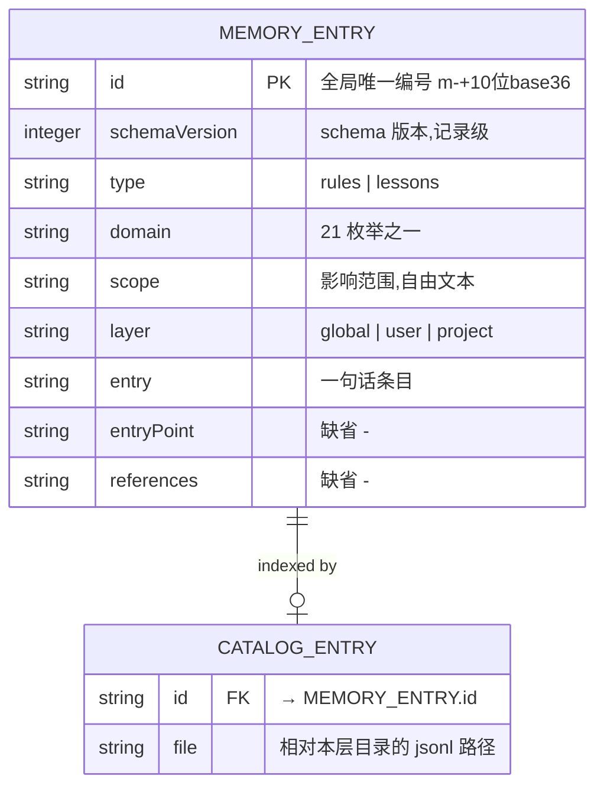

# 数据契约与演进式数据设计(Data Contract & Evolutionary Data Design)

本文按「数据契约 + 演进式数据设计」范式审查 dsh-memory 的持久化数据,给出 ER 图、3NF 数据对象,并落地「Data + Schema + Migrate 三者同时存在」的约束。它是 concept.md(领域模型)与 design.md(技术设计)在**数据治理**维度的补充。

## 1. Tier 判定与核心指令

**`.remember.jsonl`(真相源)是 Tier 1 数据**,触发「核心指令」全部条件:

| 触发条件 | dsh-memory 是否满足 |
|---|---|
| 数据属于未来长期使用 | ✅ 长期记忆是跨会话持久化的核心资产 |
| 数据已经被代码使用 | ✅ store.ts / team.ts / extract.ts 消费 |
| 数据已经存储为数据文件格式 | ✅ JSONL(一行一条 JSON) |

**核心指令**:Data + Schema + Migrate Script 三者**必须同时存在**,缺一不可。

## 2. Review 结论:当前差距

| 三者 | 范式要求 | 当前 dsh-memory 现状 | 结论 |
|---|---|---|---|
| **Data** | 有 | `.remember.jsonl`(真相源)+ `.remember.md`(投影)+ `catalog.json`(派生索引) | ✅ 齐备 |
| **Schema** | JSON/YAML 数据 → `*.schema.yaml` | `src/schema.ts` 内嵌 schemastery `z.object`(TS 代码),**无独立 `.schema.yaml`** | ❌ 形态不对 |
| **Migrate** | 显式、版本化的迁移脚本 | 惰性迁移 `parseEntryMigrating`(读取时补 `id`),**无 `migrations/`、无版本号历史** | ❌ 缺显式版本化 |

**附加差距(可追溯性)**:

1. **jsonl 记录无 `schemaVersion` 字段**——`serializeEntry` 序列化 8 字段,不含版本。无法回答「这条数据是哪个 schema 版本写的」。
2. **已发生的迁移未固化**——「v0(无 id)→ v1(有 id)」是真实发生过的 schema 变更,但只存在代码里的惰性逻辑,没有独立迁移脚本。
3. **catalog 冗余**(3NF 视角)——`catalog.json` 的 `CatalogEntry` 复制了 `type/domain/scope/layer/entry` 五个字段(见 §3)。

## 3. ER 图与 3NF 数据对象

### 3.1 实体识别



- **`MEMORY_ENTRY`(记忆条目)** = 唯一需要持久化的**事实实体**。
- **`CATALOG_ENTRY`(目录索引条目)** = **派生实体**(物化投影),由 MEMORY_ENTRY 扫描重建,服务「id → 文件」定位。

### 3.2 3NF 检查

**MEMORY_ENTRY(满足 3NF)**:

- 主键 `id` 单字段、非复合 → 无部分依赖(2NF ✅)。
- 非主属性均**直接**依赖 `id`,无 `id → X → Y` 传递依赖(3NF ✅)。
- `domain`/`layer`/`type` 是 **closed 枚举 = schema 契约**,不抽维度表;中文名/说明属文档(concept.md §3/§8),不进入数据。

**CATALOG_ENTRY(有意反规范化)**:

- 严格 3NF 应只留 `{ id, file }`(纯索引)。
- 当前 `CatalogEntry` 额外复制 `type/domain/scope/layer/entry` → **有意反规范化**,动机是「不读 jsonl 即能按维度 filter」。属可接受权衡,已显式声明。

## 4. Data + Schema + Migrate 三件套设计(已落定)

### 4.1 Data(已存在)

`.remember.jsonl`(真相源)+ `.remember.md`(投影)+ `catalog.json`(派生索引)。

### 4.2 Schema —— `schema/memory-entry.schema.yaml`(单一真相源)

**已决策:单一真相源。** `schema/memory-entry.schema.yaml`(JSON Schema 的 YAML)是数据契约的**唯一权威**,运行时 schemastery 校验器由它**生成**,不手写第二份。

- **落点**:`schema/memory-entry.schema.yaml`,声明 10 字段(8 个业务字段 + `schemaVersion` + `createdAt`),含 enum、pattern、minLength、required、default。
- **代码生成**:`scripts/gen-schema.mjs` 读 yaml → 生成 `src/schema.generated.ts`(schemastery `z.object` + 枚举常量 `DOMAINS`/`LAYERS`/`MEMORY_TYPES` + 正则 `MEMORY_ID_RE` + 类型)。
- **运行时零 yaml 依赖**:import 的是生成后的纯 TS;yaml 解析(`yaml` 库)只在 codegen(devDependency)用。
- **防漂移**:`schema.generated.ts` 是生成产物,改动只发生在 schema.yaml;一条契约测试断言「生成的枚举/正则与 yaml 一致」(防手改生成文件)。

**职责边界**:schema.yaml 承载「数据字段契约 + 枚举 + 正则」。非数据契约(`TABLE_HEADER`/`TABLE_SEPARATOR` 渲染常量、`FILE_NAME_RE` 文件命名、`MAX_LESSON_CHARS` 条件业务上限)留在 `src/schema.ts` 手写。

### 4.3 Migrate —— `migrations/` + 自建迁移引擎

数据格式是 JSONL,**没有成熟的数据库迁移引擎适用**(Flyway/Liquibase/Prisma 都是关系库)。按范式「缺乏成熟引擎时自建」→ **自建轻量迁移**:

```
migrations/
  0001-add-id-and-version.ts        # v0(无 id/无 schemaVersion)→ v1(补 id + schemaVersion=1)
  0002-add-created-at.ts            # v1 → v2(补 createdAt,按文件名日期取当天本地零点)
src/migrate.ts                      # 迁移执行器
```

**迁移执行器语义**(取代 `parseEntryMigrating` 惰性逻辑):

1. 读一行 JSON,读 `schemaVersion`(缺省 = 0)。
2. 依次应用所有 `version > 当前` 的迁移(每个迁移导出 `up(record)` 转换函数)。
3. 写回 `schemaVersion` = 当前最新版本。
4. 严格校验(required 全满足)。

**迁移与校验分离**(符合范式「Schema 是契约,旧数据经迁移升级到符合契约」):

- 旧数据(缺 `id`/`schemaVersion`)**不通过**严格校验,由迁移引擎补全。
- 迁移后才是合法数据,严格校验放行。

### 4.4 版本控制 —— 记录级 `schemaVersion`(已决策)

**已决策:记录级。** 每条 jsonl 记录带 `schemaVersion` 字段(整数,单调递增),落地「这条数据是哪个 schema 版本写的」。

- **记录级 `schemaVersion`**:管**记忆条目**的演进;`MemoryEntry` 8→10 字段(加 `schemaVersion` 与 `createdAt`;`SCHEMA_VERSION` 当前 = 2)。
- **文件级 `catalog.json` 已有 `CATALOG_VERSION`**(=1):管**索引**的演进。
- `schemaVersion` 是「演进元数据」,**不进 MD 表格**(MD 9 列,不含 schemaVersion)——它对「人阅读记忆」无意义,只供迁移引擎读;`createdAt` 进 MD 表格与面板 Timeline(按创建时间排序)。

## 5. 已拍板决策(记录)

| 决策 | 结论 |
|---|---|
| Schema 真相源 | `schema/memory-entry.schema.yaml` 单一真相源,运行时 schemastery 由它生成 |
| `schemaVersion` 粒度 | 记录级字段(`MemoryEntry` 8→10,当前 `SCHEMA_VERSION=2`) |
| 迁移引擎 | 自建(JSONL 无成熟迁移引擎);`migrations/` + `src/migrate.ts` |
| 迁移与校验 | 分离:旧数据经迁移补全 → 严格校验放行 |

## 6. 验收标准(AC)

1. `schema/memory-entry.schema.yaml` 存在,声明 10 字段(含 `schemaVersion` / `createdAt`)+ enum + pattern + required + default。
2. `scripts/gen-schema.mjs` 可重复生成 `src/schema.generated.ts`,产物与 yaml 一致(契约测试锁定)。
3. `src/schema.ts` 不再手写数据 schema;运行时的 `MEMORY_ENTRY_SCHEMA`/`DOMAINS`/`LAYERS`/`MEMORY_TYPES`/`MEMORY_ID_RE` 均来自 generated。
4. `MemoryEntry` 带 `schemaVersion` 与 `createdAt` 字段,`serializeEntry` 落盘时写入;MD 表格 9 列(含 createdAt,不含 schemaVersion)。
5. `migrations/0001-add-id-and-version.ts` 存在,把缺 `id`/`schemaVersion` 的旧记录补全为 `schemaVersion=1` + 合法 `id`;`migrations/0002-add-created-at.ts` 存在,把 v1 记录补 `createdAt`(按文件名日期取当天本地零点)并升到 `schemaVersion=2`。
6. `src/migrate.ts` 读记录 → 按 `schemaVersion` 依次应用缺失迁移 → 写回版本 → 严格校验。
7. 旧数据(无 id)经迁移后可被严格校验放行;新数据直接通过。
8. `pnpm test` 与 `pnpm typecheck` 全绿。
